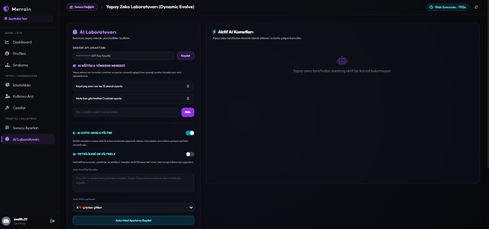
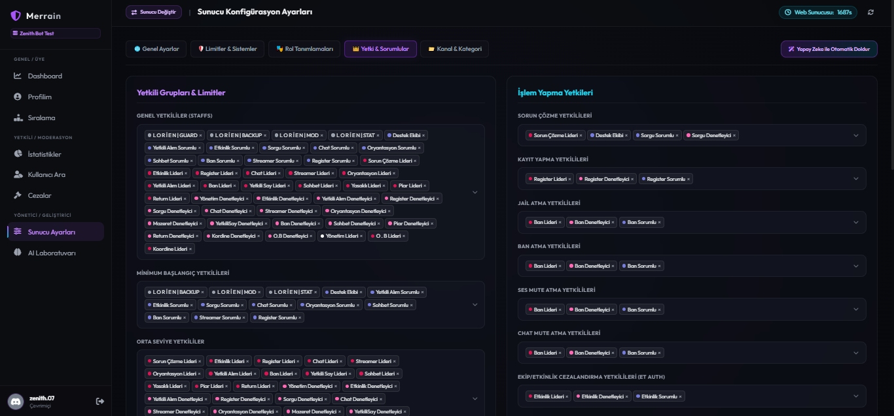
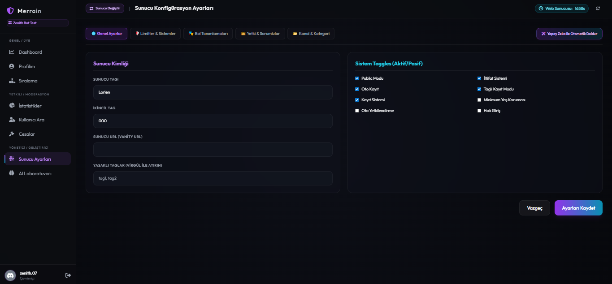
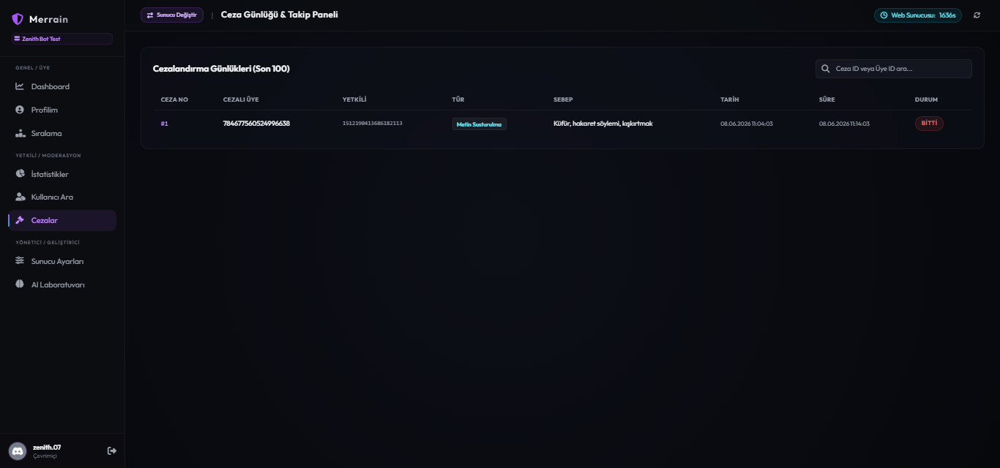
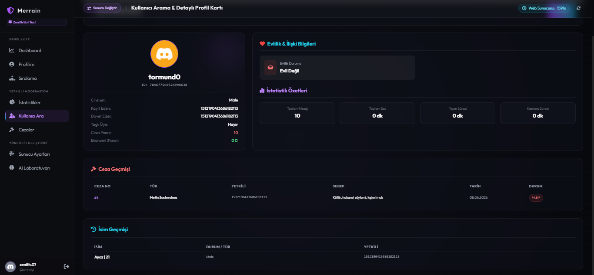
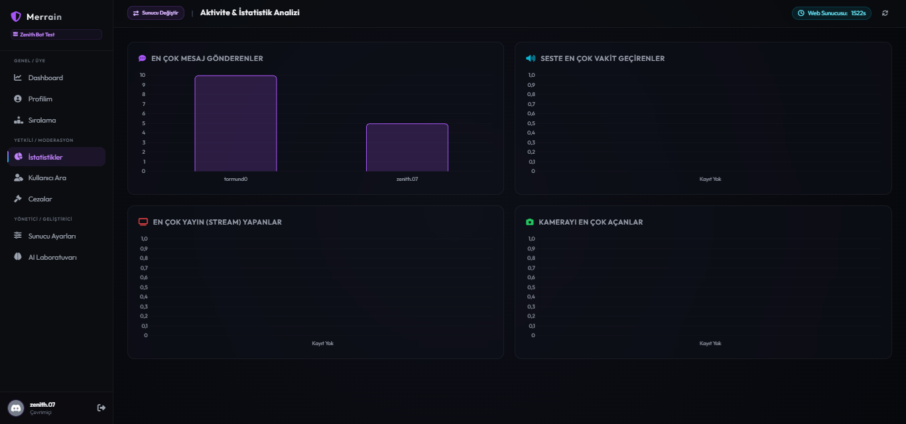
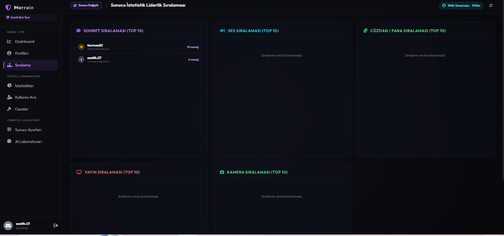
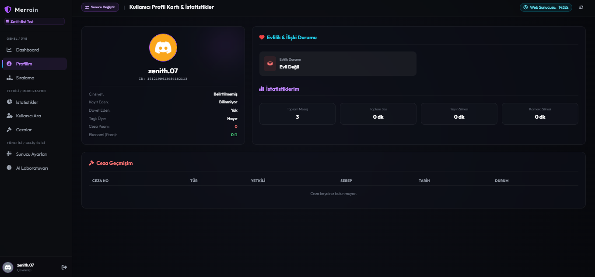
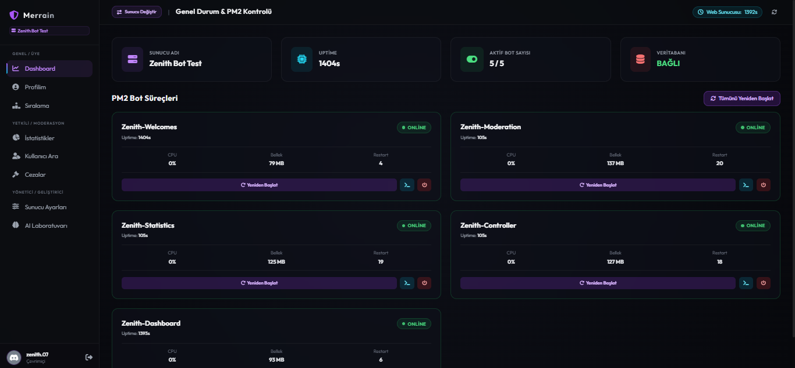
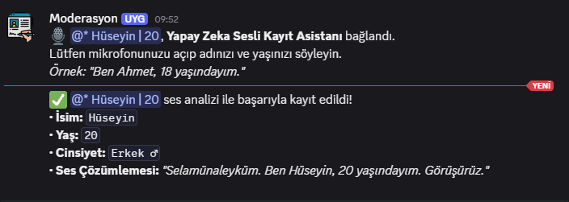

# 🤖 Discord AI Web Dashboard & Bots (Yapay Zeka Destekli Yönetim ve Kayıt Sistemi)

Discord sunucunuzu tamamen yapay zeka ile yönetin, eğitin ve sesli komutlarla otomatik kayıt gerçekleştirin! Modern bir web paneline sahip, kendi kendini iyileştiren (self-healing) yeni nesil Discord bot altyapısı.

---

## 🌟 Öne Çıkan Özellikler

### 🎙️ Yapay Zeka Sesli Kayıt Asistanı (AI Voice Register)
* **Otomatik Cinsiyet ve İsim Algılama:** Kayıt kanalına giren kullanıcı sadece adını ve yaşını söyler. Yapay zeka ses analizini yaparak cinsiyeti (Erkek/Kadın) algılar, sunucu kaydını yapar, rolleri dağıtır ve ismi düzenler.
* **Mükemmel Güvenlik:** Aynı kişinin farklı ses tonlarıyla veya farklı isimlerle mükemmeliyetçi kontrol sistemi sayesinde sahte kayıt yapmasını engeller.

### 🧠 Gelişmiş AI Eğitim ve Yönerge Merkezi (AI Training Center)
* **Doğal Dil ile Yapılandırma:** Komut ezberlemeye son! Yapay zekaya *"Sunucudaki ban limitini 3 yap"* dediğinizde tüm limitleri otomatik ayarlar.
* **Akıllı Rol Eşleştirme:** *"Sunucuda male, aragorn veya bay geçen rolleri erkek rolü olarak tanımla"* dediğinizde yapay zeka bunları analiz eder ve otomatik olarak erkek rolleri listesine ekler.
* **Tek Seferlik Eğitim:** Botu sadece bir kez eğitmeniz yeterlidir.

### 🛠️ Kendi Kendini Onarma (Self-Healing System)
* Bot, çalışma sırasında meydana gelebilecek olası hataları otomatik olarak tespit eder, çözüm üretir, kod tabanını düzeltir ve kendisini yeniden başlatarak kesintisiz hizmet sunar.

### 📊 Günlük Raporlama & Şüpheli Tespiti
* Sunucudaki fotoğraf paylaşımlarını, mesajları ve logları tarayarak günlük özet raporlar oluşturur.
* Güvenliği tehdit eden şüpheli kişileri tespit edip ayrı bir log kanalında detaylıca raporlar.

---

## 📸 Görseller & Ekran Görüntüleri

Burada sistemin paneline, ayar ekranlarına ve işleyişine dair ekran görüntülerini inceleyebilirsiniz:

### 🖥️ Web Panel ve Arayüz

  

  

  

### ⚙️ Ayar ve Kontrol Ekranları

  

  

  

### 📈 Log ve Veri Analizi

  

  

  

  

### 🎙️ Yapay Zeka Ses Kayıt Sistemi Aktif Görünümü

  

---

## 🚀 Durum ve Geliştirme Süreci
> [!NOTE]  
> Projenin tüm temel geliştirme süreçleri başarıyla tamamlanmıştır. Gelişimi tamamen bittiğinde ve test süreçleri sonlandığında genel kullanıma sunulacaktır.

---
*Geliştiren ve Tasarlayan: **[Tormund / Tormund0](https://github.com/Tormund0)***
